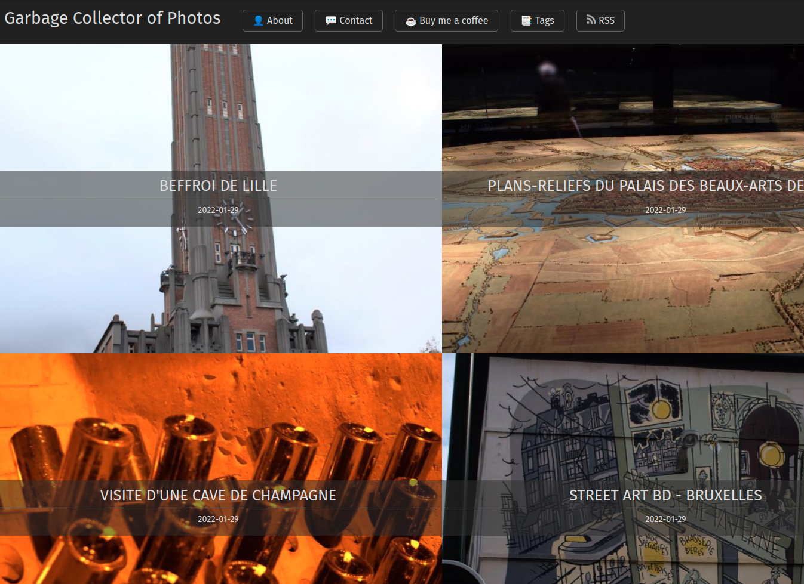

# Garbage Collector of Photos Hugo Theme



## Introduction

This theme is a custom-made for my Photo Blog based on [Hugo](https://gohugo.io). The front page displays the album covers, and the post page display the photos with EXIF metadata and the possibility to write some text with it.

## How to install

Clone this repository and add the theme to your Hugo configuration.

```bash
git clone https://github.com/Wivik/garbage-collector-photo-blog.git
```

In your config file :

```yaml
theme: garbage-collector-photo-blog
```

## Configuration

This theme is very simple to configure.

Example file :

```yaml
baseURL: 'https://yoursite.com'
languageCode: 'en-us'
title: "Garbage Collector of Photos"
theme: garbage-collector-photo-blog

author:
  name: Seb

menu:
  main:
    - identifier: "tags"
      name: "📑 Tags"
      url: "/tags/"
      weight: 40
    - identifier: "rss"
      name: "RSS"
      pre: icons/rss.png
      url: "/index.xml"
      weight: 50

privacy:

  vimeo:
    disabled: false
    simple: true

  twitter:
    disabled: false
    enableDNT: true
    simple: true

  instagram:
    disabled: false
    simple: true

  youtube:
    disabled: false
    privacyEnhanced: true
```

## How to use

Create a directory your Hugo site `assets/` folder, for example `my-photos-album`, and put your pictures inside it.

Create a new page with the following command :

```bash
hugo new my-photo-album/_index.md
```

The name of the folder must match the folder name inside `assets/`.

The archetype will generate a page with the following items prefiled :

```markdown
---
title: "My Photos album"
date: 2022-01-29T23:12:05+01:00
albumthumb: "my-photos-album/photo01.jpg"
draft: false
## Optional additional meta info for resources list
#  alt: Image alternative and screen-reader text
#  phototitle: A title for the photo
#  description: A sub-title or description for the photo
tags:
  - Todo
---









```

In case the archetype won't work, copy the `default.md` file present in `garbage-collector-photo-blog/archetypes/default.md` in the `archetypes` folder present in the Hugo site.

## License

This theme is licensed under the [MIT License](LICENSE).

Some CSS parts come from the [SimpleCSS](https://simplecss.org) framework for general design like buttons and navigation header.

The archetype used to generate the gallery page was inspired by the [AutoPhugo](https://github.com/kc0bfv/autophugo/) theme and is licensed under the Creative Commons Attribution 3.0 License.

The Creative Commons formater partial uses [Remix Icons](https://github.com/Remix-Design/remixicon) which are available under Apache License 2.0.

The partial invoked by the EXIF reader shortcode is a contribution from Hugo's forum. This specific part is licensed under a Creative Common Attribution NonCommercial ShareAlike 3.0 Unported License as [indicated by their ToS](https://discourse.gohugo.io/tos#3).

